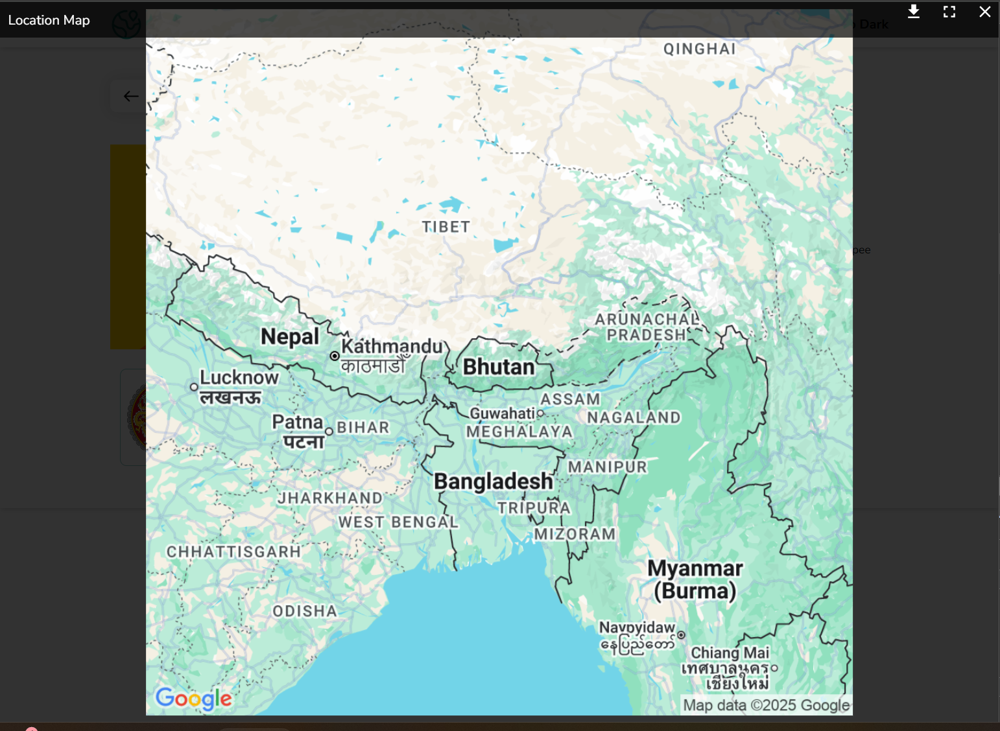
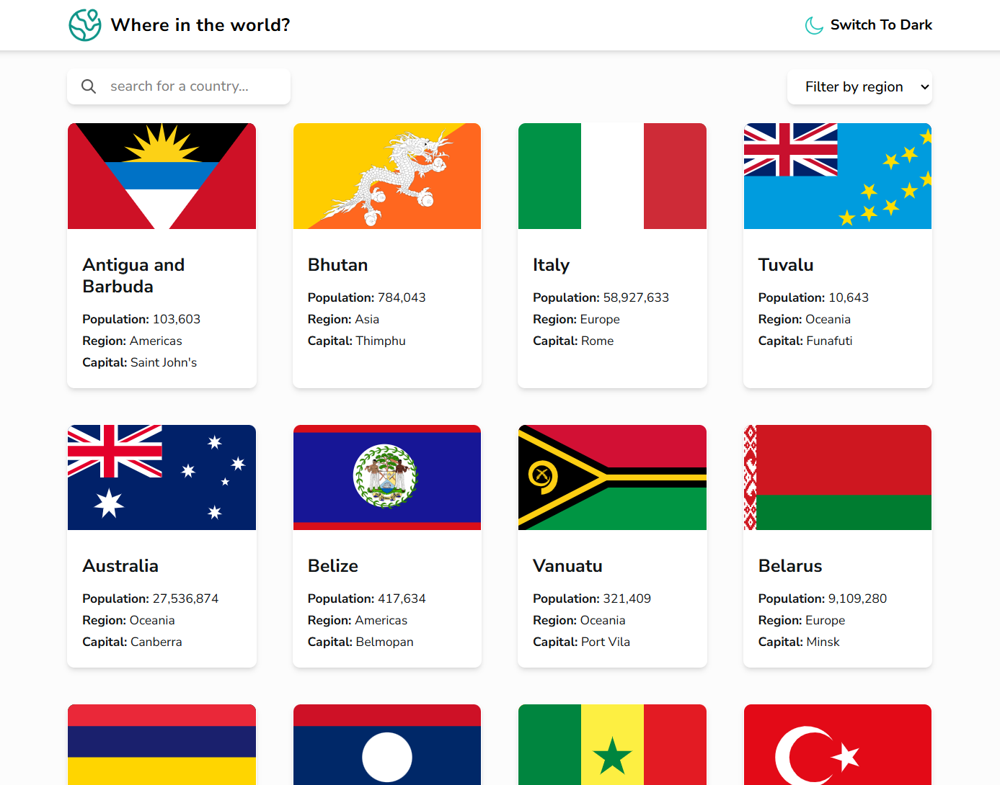
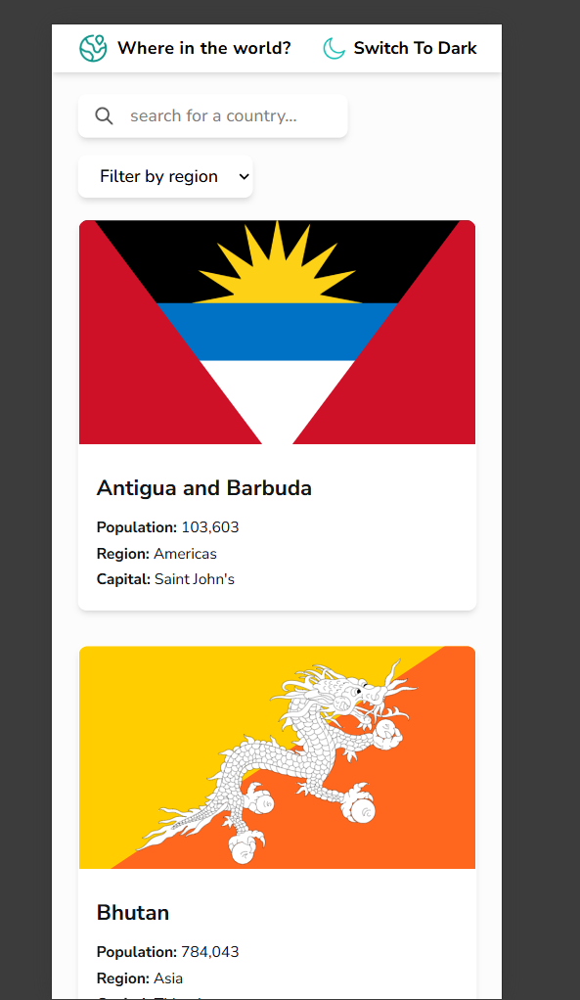
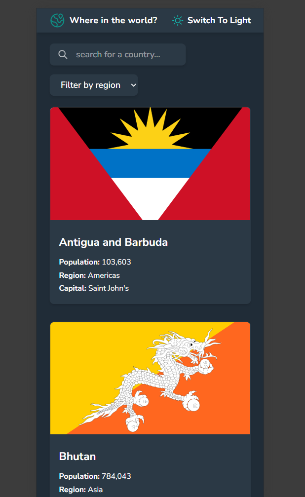
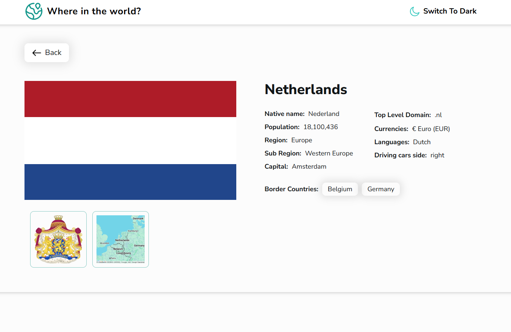
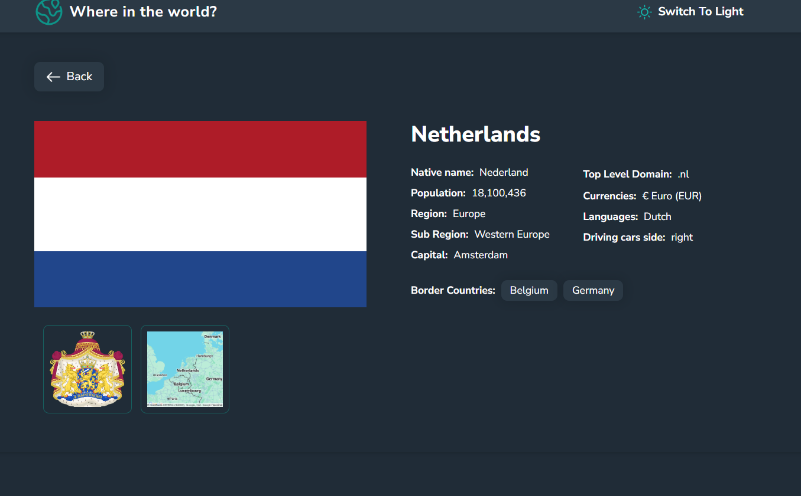
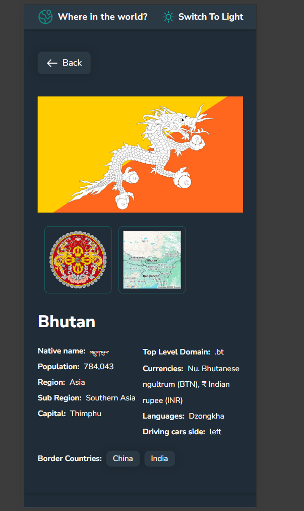
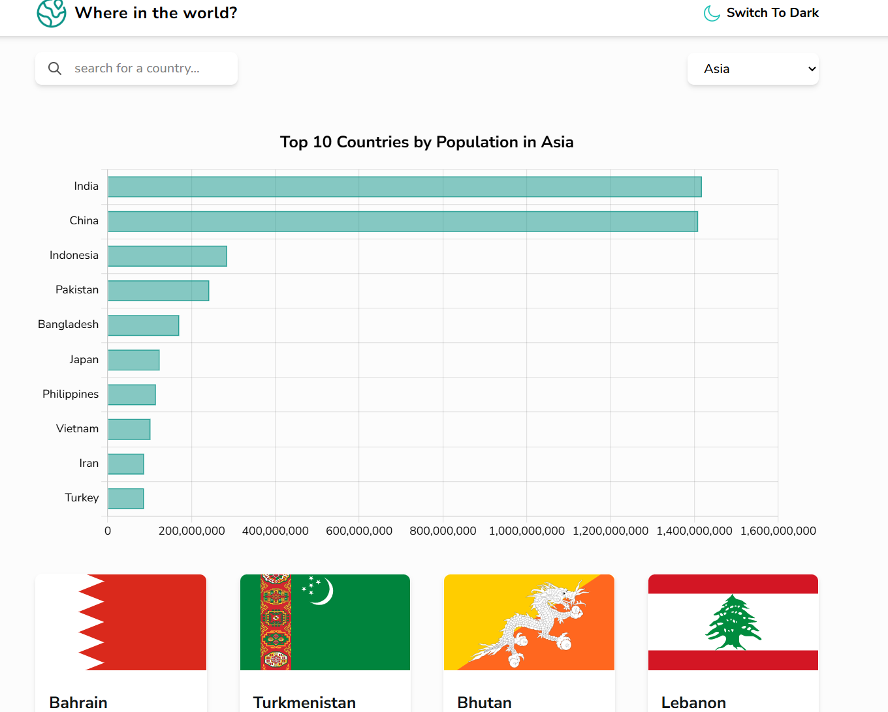
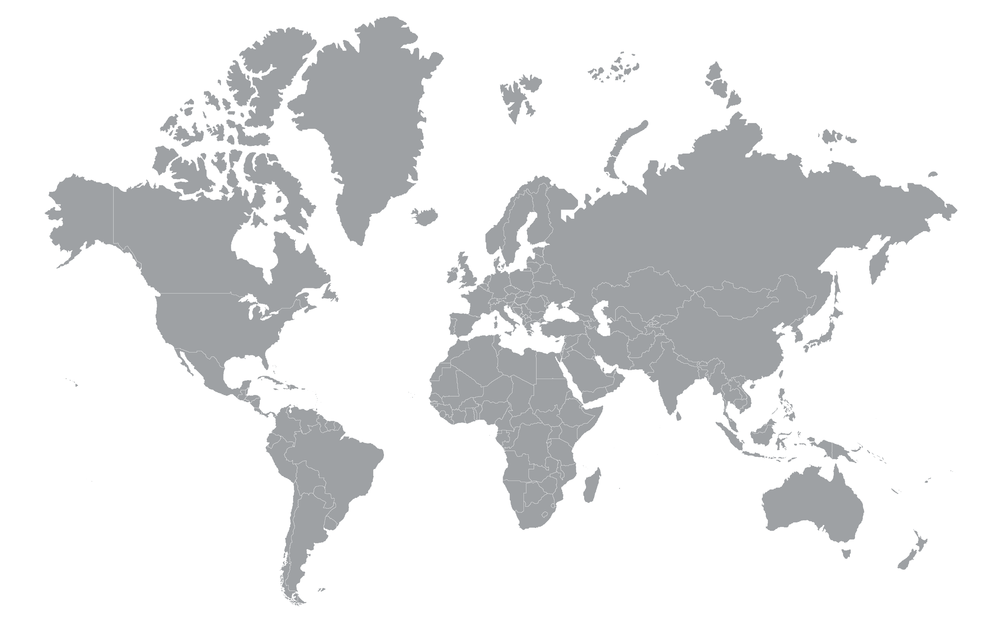

# Frontend Mentor - REST Countries API with color theme switcher solution

This is a solution to the [REST Countries API with color theme switcher challenge on Frontend Mentor](https://www.frontendmentor.io/challenges/rest-countries-api-with-color-theme-switcher-5cacc469fec04111f7b848ca). Frontend Mentor challenges help you improve your coding skills by building realistic projects. 

## Table of contents

- [Overview](#overview)
  - [The challenge](#the-challenge)
  - [Screenshot](#screenshot)
  - [Links](#links)
- [My process](#my-process)
  - [Built with](#built-with)
  - [What I learned](#what-i-learned)
  - [Continued development](#continued-development)

## Overview

### The challenge

I've used this app to practice React Router in declarative format to display details page for each country. Also I deployed it in Vercel as opposed to Netlify used in prev projs.

Users should be able to:

- See all countries from the API on the homepage
- Search for a country using an `input` field
- Filter countries by region
- Click on a country to see more detailed information on a separate page
- Click through to the border countries on the detail page
- Toggle the color scheme between light and dark mode *(optional)*

#### Ways I've extended the OG brief to push myself further or just amended things:

- show map for details page using google maps static generator api

- show coat of arms & small map in mini gallery underneath the flag, when clicked on them, open in gallery-like mode
- show top 10 countries for population in filtered region using chart js
- use primary bright teal for logo & loading spinners to add some highlight
- use react-spinners for loading symbol
- using icon as logo with map pin (in line with the name of the app 'where in the world') from flaticon & also as favicon
- add info about the side of driving in detail info section
- hover states for light & dark modes for elements like btns & cards
- narrower grid items for country grid - my main container is narrower

### Screenshots

### Links

- Solution URL: [Solution Link on FE Mentor](https://www.frontendmentor.io/solutions/countries-app-with-react-AXZEDUX9mz)
- Live Site URL: [Countries App w/React](https://countries-app-kohl-nine.vercel.app/)

## My process

### Built with

- [React](https://reactjs.org/) - JS library
- [React Router](https://reactrouter.com/) - routing, pages
- [Chart js](https://nextjs.org/) - React framework
- [React Spinners](https://www.npmjs.com/package/react-spinners) - react loading symbols
- [React Modal Image](https://www.npmjs.com/package/react-modal-image) - mini gallery

### Continued development

- there are some bugs where i  click on Ireland & it goes to the UK detail page instead - need to investigate, maybe it thinks its Northern Ireland?
- the coat of arms take a while to load, so need to be loading symbol there. Same for maps.
- I've got error state & loading state for border countries commented out for now, will need to be implemented.
- When filtering by region, the chart should dissapear & show loading state, then when ready - display appropriate data for the selected region. Currently it is showing previous area chart before displaying new one.
- Bonus potential: detect your country based on your browser & show stats for that country
- Detect & adjust dark/light mode depending on browser preferences.
- more charts for area, GDP etc.
- instead of static google map, make it dynamic, able to zoom etc
- make map interactive as home page view (instead or together with the OG grid). Show image like the one below to start with (I've experiemented with showing this as bg img but it made things harder to read, plus most of it would be covered, so the usefullness of the map kinda dissapears). Start with the map, then hovering over would show info about each country. Then take user to detail page as before. Maybe give 2 options: display grid of countries as well as map view, ability to switch b/w the 2.

